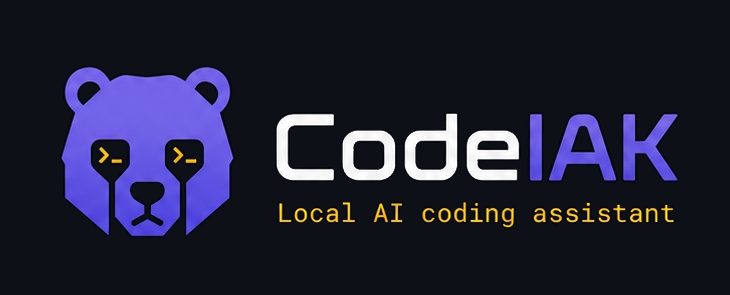
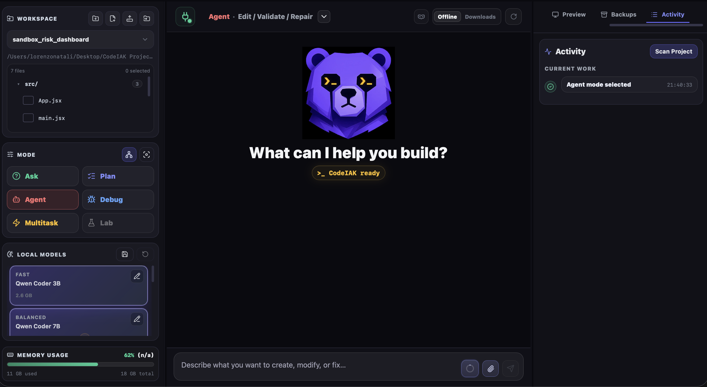
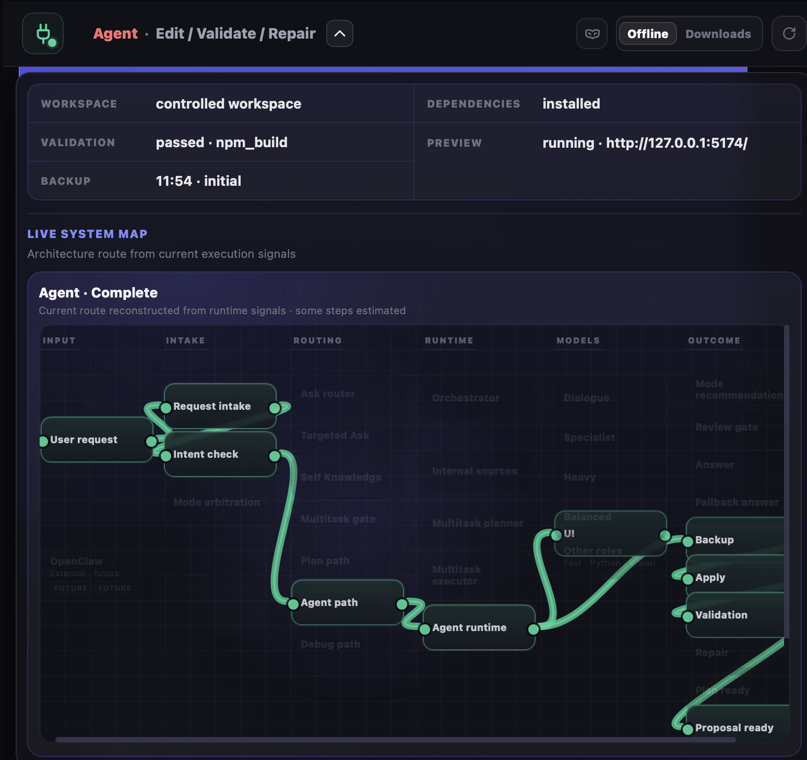
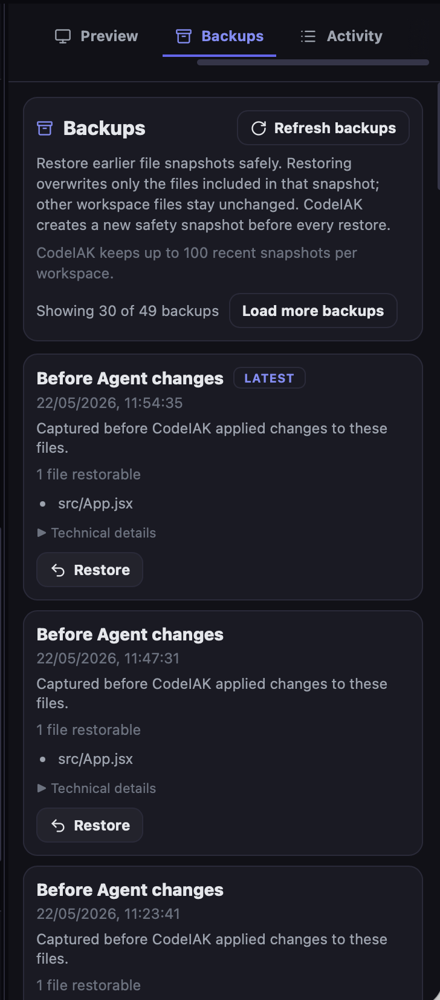
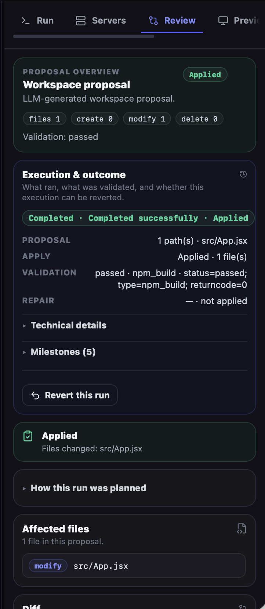
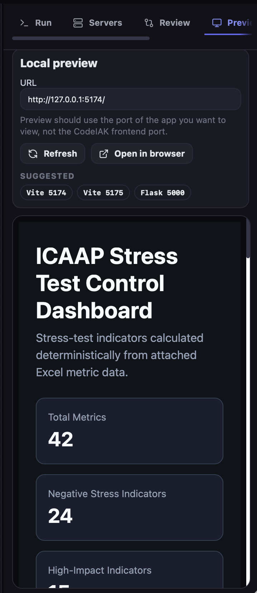
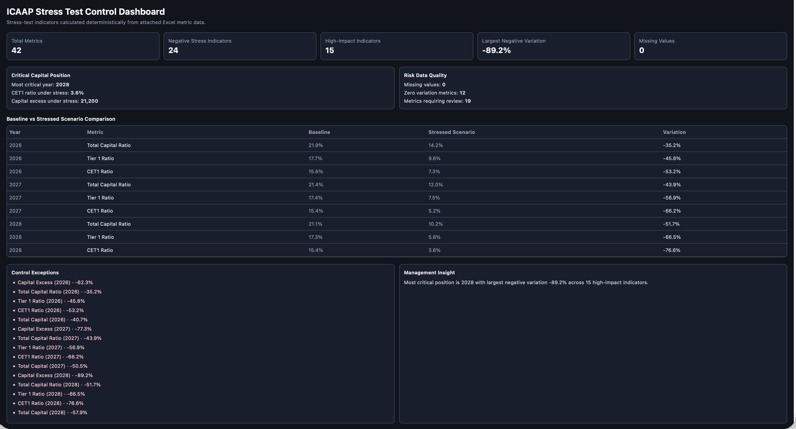
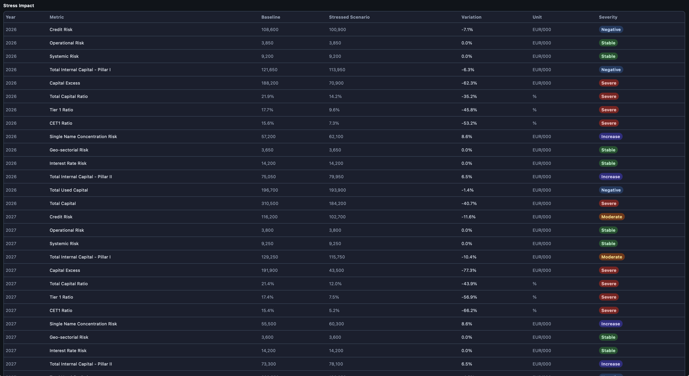

<p align="center">
  
</p>

# CodeIAK

**Local-first AI coding agent with multi-model orchestration, reviewable changes, and agentic workflows.**

> **Status:** Active Alpha · Work in Progress  
> **This repository:** Public project page and showcase — **not** a full code release or install guide.

---

CodeIAK is a **local-first AI coding agent** for developers who want powerful automation without giving up control. It runs on your machine using **local GGUF models**, a dedicated workspace UI, and a backend that can analyze and change project files — but treats every edit as a **reviewable proposal** with backups, validation, repair, and revert paths when things go wrong.

Unlike a generic chat wrapper around a single model, CodeIAK is built as a **small agent runtime**: purpose-specific model slots, mode-aware workflows, and transparent execution you can inspect step by step.

Audit and risk workflows are used as professional demo scenarios, but they are **not** the product boundary. CodeIAK is designed as a general-purpose local coding agent for controlled file editing, data-to-UI workflows, validation, and traceable execution.

---

## Why CodeIAK

Many coding assistants either depend on the cloud, hide what they changed, or apply edits without a safe rollback path. CodeIAK takes a different approach:

- **Runs locally** — GGUF models via `llama-cpp-python`; no cloud API required for core operation
- **Separates thinking from doing** — Ask and Debug explain without writing files; Plan and Agent prepare bounded workspace changes
- **Makes automation inspectable** — proposals appear as diffs in a Review tab before apply
- **Protects your workspace** — backups before writes, revert paths, allowlisted commands, offline-by-default networking
- **Routes intelligently** — multiple model roles, mode-aware workflows, and seamless mode recommendations when a request belongs elsewhere

The goal is not opaque code generation. It is **inspectable, reversible automation** on local projects you own.

---

## At a glance

- **Modes:** Ask · Plan · Agent · Debug · Multitask · Targeted Ask routing
- **Model Manager:** Eight configurable GGUF slots with memory suitability hints
- **Review-first edits:** Propose → diff preview → apply → validate → repair
- **Agent execution:** Autonomous bounded runs with milestones, activity timeline, and revert
- **Multitask:** Decompose objectives into sequential subtasks with review gates
- **Document and data intelligence:** Attach PDF, DOCX, and XLSX as read-only source context; selected Agent workflows can transform spreadsheet data into validated workspace outputs
- **Offline-first:** Local backend, local models, explicit network permission gate for downloads

---

## Interface preview

CodeIAK's primary interface is a controlled three-panel workspace: project navigation and mode controls on the left, chat-based task intake in the center, and execution/review tools on the right.

<p align="center">
  
</p>

<p align="center">
  <em>CodeIAK's main workspace combines mode-aware task intake, local model controls, reviewable changes, activity traces, preview tools and controlled execution in a single interface.</em>
</p>

---

## Demo — Excel-to-Dashboard Agent Workflow

https://github.com/user-attachments/assets/28e65618-ce09-4180-889e-08502989e49c

<p align="center">
  <em>Excel stress-test data → deterministic metrics → UIgen dashboard rendering → data-lock validation → React build validation → local preview.</em>
</p>

CodeIAK receives an ICAAP-style stress-test Excel file as a read-only source, calculates risk indicators deterministically, locks the calculated values into a dashboard specification, uses UIgen to generate the React interface, validates the generated output, and serves the result locally.

| Stage | What CodeIAK does |
| --- | --- |
| Source | Reads the Excel file as read-only input |
| Calculation | Computes stress-test metrics deterministically |
| UI generation | Uses UIgen to render the React interface |
| Control | Runs data-lock validation and build validation |
| Output | Modifies only `src/App.jsx` and serves local preview |

> **Execution principle:** the LLM is not used to invent spreadsheet values. Calculations are performed deterministically from the attached Excel data; UIgen is used for interface structure, layout and presentation.

### Runtime evidence

<table>
  <tr>
    <td width="50%" align="center">
      
      <br>
      <sub><strong>Live System Map.</strong> The route shows Agent runtime, UI model involvement, backup, apply and validation.</sub>
    </td>
    <td width="50%" align="center">
      
      <br>
      <sub><strong>Backups.</strong> CodeIAK creates restore points before applying Agent changes.</sub>
    </td>
  </tr>
</table>

<table>
  <tr>
    <td width="50%" align="center">
      
      <br>
      <sub><strong>Review and validation.</strong> The run modifies only <code>src/App.jsx</code>, passes build validation and remains revertible.</sub>
    </td>
    <td width="50%" align="center">
      
      <br>
      <sub><strong>Local preview.</strong> The generated React dashboard is served inside CodeIAK after validation.</sub>
    </td>
  </tr>
</table>

### Browser output

<p align="center">
  
</p>

<p align="center">
  <em><strong>Browser preview — dashboard overview.</strong> The generated React dashboard shows deterministic KPIs, critical capital position, data-quality indicators, baseline-vs-stressed comparison, control exceptions and management insight.</em>
</p>

<p align="center">
  
</p>

<p align="center">
  <em><strong>Browser preview — stress impact table.</strong> Row-level stress metrics preserve source values while adding calculated variation and severity classification.</em>
</p>

---

## Core capabilities

### Conversational modes (no automatic file writes)

**Ask** — Explain code, answer questions, inspect attachments, and orient within a project. Supports **Orchestrator** routing (CodeIAK chooses the workflow) or **Targeted Ask** (route directly to Dialogue or Specialist models).

**Debug** — Diagnose errors, logs, and tracebacks in a read-only diagnostic mode.

### Operational modes (workspace-aware)

**Plan** — Analyze selected files and produce a **single review-first proposal** for manual approval.

**Agent** — Run a **bounded autonomous controller**: backup → apply safe edits → validate (e.g. npm build, Python CLI) → optional repair passes, with execution summaries and revert support.

**Multitask** — Turn a natural-language objective into a **structured multi-step plan**, execute subtasks sequentially, and pause when a child step needs Review approval.

### Model Manager

Configure **eight local model slots**: Fast, Balanced, Heavy, Python, UI, Dialogue, Vision, and Specialist. CodeIAK’s orchestrator selects roles per task type — decomposition, proposals, conversational Ask, self-knowledge, context compaction, and more. Memory suitability hints help avoid loading models that exceed available RAM.

### Document and data intelligence

Attach **PDF, DOCX, and XLSX** files to requests. Attachments remain **read-only source material**: they are not silently imported into the workspace or modified in place.

In selected Agent workflows, spreadsheet data can be parsed, classified, calculated deterministically, and used to generate validated project files such as React dashboards.

### Safety pipeline

- Workspace-scoped file access
- Review tab with diff preview before apply
- Automatic **backups** before writes; restore and execution revert
- **Validation** (npm build, Python CLI in sandbox contexts)
- **Conservative repair** for common build failures
- **Allowlisted commands only** — no arbitrary shell

### Transparency features

- **Self Knowledge** — Grounded answers about CodeIAK’s modes and behavior (deterministic FAQ plus sourced excerpts)
- **Mode arbitration** — When a request doesn’t fit the current mode, CodeIAK recommends a switch and can continue with the same prompt
- **Live System Map** — Architecture route visualization from current execution signals in the status panel

### Domain labs and data-to-UI workflows

Specialized assistants exist for **Excel formulas/templates**, **SQL drafting**, **VBA review**, and **UI design guidance**.

Most domain labs remain chat- or plan-oriented today. However, selected Agent workflows are already supported — for example, spreadsheet-to-dashboard generation with deterministic calculations, UIgen rendering, data-lock validation, backup, build validation and local preview.

---

## How the system works

```
User request
    → Intent & mode routing
    → Model role selection (orchestrator / targeted model)
    → Workspace analysis & proposal generation
    → Review (diff, metadata, validation plan)
    → [User approves]
    → Backup → Apply → Validate → [Repair if needed]
    → Activity timeline + optional revert
```

In **Multitask**, the same pipeline applies per subtask, with explicit **review gates** when a step produces a proposal.

For data-to-UI workflows, CodeIAK separates data truth from interface generation: deterministic code calculates and locks values, while UIgen handles layout and presentation under validation.

---

## Architecture at a glance

```
┌─────────────────────────────────────────────────────────┐
│  CodeIAK UI (React / Vite)                              │
│  Chat · Modes · Model Manager · Review · Activity · …   │
└──────────────────────────┬──────────────────────────────┘
                           │ HTTP (local)
┌──────────────────────────▼──────────────────────────────┐
│  CodeIAK Backend (Flask)                                  │
│  Routing · Proposals · Agent controller · Multitask · …   │
└──────┬───────────────────────────────┬──────────────────┘
       │                               │
┌──────▼──────┐                 ┌──────▼──────┐
│ local_llm   │                 │ workspace/  │
│ GGUF slots  │                 │ backups/    │
│ llama-cpp   │                 │ validation  │
└─────────────┘                 └─────────────┘
```

All inference stays **on-machine**. No cloud API is required for core operation.

---

## Multi-model routing

| Pattern | Behavior |
| --- | --- |
| **Orchestrator (Ask)** | CodeIAK selects dialogue, specialist suggestions, or standard Ask paths per request |
| **Targeted Ask** | Bypass general routing; send directly to configured **Dialogue** or **Specialist** slot |
| **Specialist profile** | Domain display name, description, and trigger terms in Model Manager |
| **Specialist–Builder (Agent)** | Optional domain brief merged into builder proposals for structured artifacts |

**Vision slot:** configurable in Model Manager (including multimodal projector path) — **inference routing is not active yet**.

---

## Offline-first operation

- Default **offline mode** restricts network activity
- **Downloads Allowed** is an explicit, user-controlled gate for dependency installs
- Backend binds to **local host**; models load from local GGUF paths you configure

---

## OpenClaw integration (optional, external)

CodeIAK includes an **optional OpenClaw bridge** for external orchestrators. This is an **integration path**, not an in-app autonomous director.

What exists today:

- Read-only CLI tools (`listFiles`, `analyze`, `inspect`, `proposeWorkspaceChanges`, …)
- **Multitask HTTP tools** (`multitaskProposePlan`, `multitaskExecutePlan`) against the local CodeIAK server
- A deterministic in-app bridge that delegates to validated CodeIAK workflows

Design constraints:

- OpenClaw does **not** bypass CodeIAK’s workspace safety layer or apply file changes on its own in Multitask flows
- When a child step requires review, the external orchestrator must **stop** — apply happens in CodeIAK’s Review tab
- CodeIAK remains the **execution runtime**; human-in-the-loop review is non-negotiable

OpenClaw as an **in-app director** is a future direction, not current product behavior.

---

## Current development status

CodeIAK is in **Active Alpha · Work in Progress**. Substantial areas are implemented and covered by automated tests, including:

- Six active UI modes plus Targeted Ask routing
- Model Manager with eight slots
- Propose / Review / Apply / Backup / Revert
- Agent autonomous runs with validation and repair
- Multitask plan → execute with review gates
- Document and data attachments (PDF / DOCX / XLSX)
- Selected Excel-to-dashboard Agent workflows
- Context compaction for long Ask sessions
- Mode recommendation handoffs
- Self Knowledge and Live System Map

**Current alpha limitations:**

- **Lab mode** UI is disabled (“Coming soon”)
- **Multitask does not auto-resume** after a review gate in the same run
- **Vision inference** is not routed yet
- **SQL and VBA labs** remain chat-oriented today; Excel support includes selected Agent workflows, while broader workbook editing and formula-writing automation remain future work
- **Deep session persistence** and advanced plan editing are not in scope for this alpha

---

## Roadmap (indicative)

**Near term**

- Active Alpha hardening and manual test campaign completion
- Product-facing polish for core intake and handoff flows
- Public documentation and selective open-release planning

**Medium term**

- Lab mode shell and expanded domain workflows
- Vision slot routing for screenshot / image tasks
- Multitask resume after review
- Richer specialist auto-routing

**Longer term**

- Deeper project memory and cross-session continuity
- Installable public release with setup guides and licensing clarity

*Roadmap items are directional, not commitments.*

---

## Public release note

This GitHub repository (`codeiak`) is a **public-facing project page** for CodeIAK.

- **You cannot install or run CodeIAK from this repository today.**
- **Source code, licensing, and setup instructions will be published in a later phase.**
- This page summarizes architecture, capabilities, and current status based on the private alpha codebase.
- See [NOTICE.md](NOTICE.md) for rights and release status.

For portfolio and recruitment purposes, treat this README as the canonical public description until a full release is announced.

---

## Technologies

| Layer | Stack |
| --- | --- |
| UI | React, Vite |
| Backend | Python, Flask |
| Inference | `llama-cpp-python`, local GGUF models (Qwen2.5-Coder family defaults) |
| Testing | The private alpha codebase includes extensive Python unit and integration tests, plus frontend unit tests for key UI logic (not included in this showcase repository). |

---

## Design principles

1. **Local-first** — your code stays on your machine
2. **Review before write** — automation must be inspectable
3. **Reversible changes** — backups and revert are first-class
4. **Mode honesty** — wrong-mode requests get recommendations, not silent misfires
5. **Multi-model by design** — one model is not enough for all task types
6. **Transparency over magic** — activity timelines, system maps, and sourced self-knowledge

---

*CodeIAK — inspectable automation for local development.*
